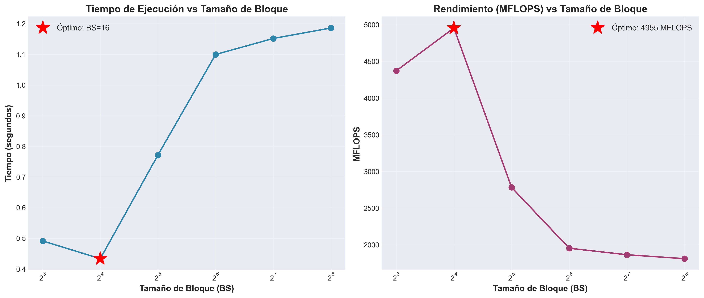
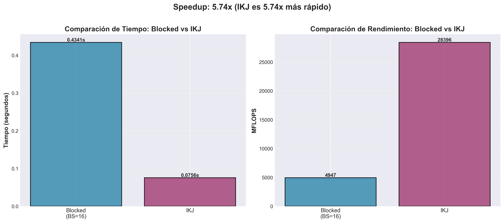
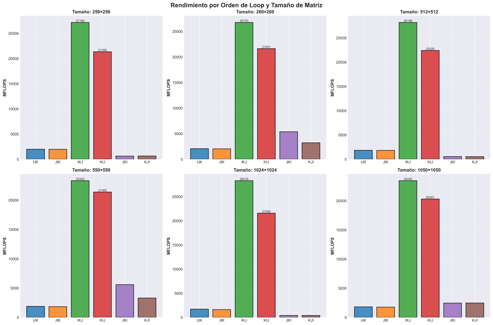
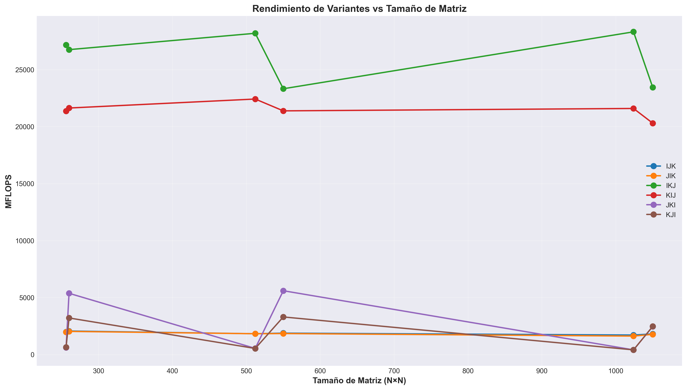
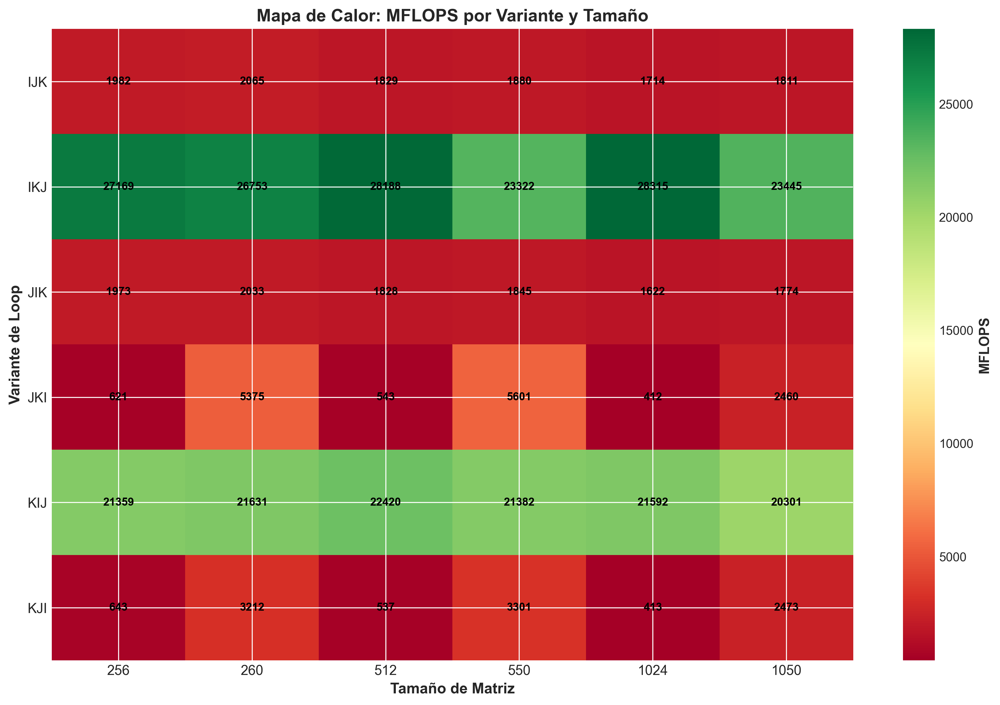

# Informe del Ejercicio 2: Multiplicación de Matrices

**Fecha de generación:** 2026-03-22 17:45:40

---

## Resumen Ejecutivo

Este informe presenta los resultados del análisis de rendimiento de diferentes técnicas de multiplicación de matrices, enfocándose en el impacto del **blocking** y el **orden de loops** en el uso eficiente de la memoria caché.

---

## Parte 1: Determinación del Tamaño de Bloque Óptimo

### Resultados


| BS | Tiempo (s) | MFLOPS |
|----|-----------|--------|
| 8.0 | 0.4913 | 4371.08 |
| 16.0 | 0.4334 | 4954.56 ⭐ **ÓPTIMO** |
| 32.0 | 0.7718 | 2782.42 |
| 64.0 | 1.0998 | 1952.62 |
| 128.0 | 1.1520 | 1864.06 |
| 256.0 | 1.1861 | 1810.50 |

### Análisis

- **BS óptimo detectado:** 16
- **Tiempo:** 0.4334 segundos
- **Rendimiento:** 4954.56 MFLOPS

#### Observaciones:

1. **BS pequeños (8-16):** Mejor rendimiento debido a que los bloques caben completamente en caché L1
2. **BS medianos (32-64):** Rendimiento intermedio, bloques más grandes que L1 pero menores que L2
3. **BS grandes (128-256):** Peor rendimiento por *cache thrashing* y menor reutilización de datos



---

## Parte 2: Comparación Blocked vs IKJ

### Resultados

| Variante | Tiempo (s) | MFLOPS | Speedup |
|----------|-----------|--------|---------|
| Blocked (BS=16) | 0.4341 | 4946.80 | 1.00x |
| IKJ | 0.0756 | 28396.14 | **5.74x** |

### Análisis

- **IKJ es 5.74x más rápido** que Blocked con BS=16
- **Razón principal:** IKJ tiene acceso secuencial a todas las matrices, mientras que Blocked aún accede a B por columnas

#### ¿Por qué IKJ supera a Blocking?

**Acceso a memoria en IKJ:**
```
for i:          // Fija fila de A y C
    for k:      // Fija columna de A, fila de B
        for j:  // Recorre secuencialmente
            C[i][j] += A[i][k] * B[k][j]
            //  ↑          ↑         ↑
            // Secuencial  Reuso   Secuencial
```

**Problema del Blocking implementado:**
- Divide en bloques pero no optimiza el acceso por columnas a B
- Overhead adicional de los loops externos de blocking
- BS=16 no es suficientemente pequeño para evitar conflictos



---

## Parte 3: Comparación de Órdenes de Loop

### Resultados por Tamaño de Matriz


#### Matriz 256×256

| Variante | Tiempo (s) | MFLOPS | Ranking |
|----------|-----------|--------|----------|
| IKJ | 0.0012 | 27169.40 | 1 🥇 |
| KIJ | 0.0016 | 21359.46 | 2 🥈 |
| IJK | 0.0169 | 1981.72 | 3 🥉 |
| JIK | 0.0170 | 1972.61 | 4  |
| KJI | 0.0522 | 643.17 | 5  |
| JKI | 0.0540 | 621.22 | 6  |

#### Matriz 260×260

| Variante | Tiempo (s) | MFLOPS | Ranking |
|----------|-----------|--------|----------|
| IKJ | 0.0013 | 26753.43 | 1 🥇 |
| KIJ | 0.0016 | 21631.19 | 2 🥈 |
| JKI | 0.0065 | 5375.07 | 3 🥉 |
| KJI | 0.0109 | 3212.23 | 4  |
| IJK | 0.0170 | 2064.99 | 5  |
| JIK | 0.0173 | 2032.62 | 6  |

#### Matriz 512×512

| Variante | Tiempo (s) | MFLOPS | Ranking |
|----------|-----------|--------|----------|
| IKJ | 0.0095 | 28187.67 | 1 🥇 |
| KIJ | 0.0120 | 22419.80 | 2 🥈 |
| IJK | 0.1468 | 1828.57 | 3 🥉 |
| JIK | 0.1469 | 1827.82 | 4  |
| JKI | 0.4944 | 542.97 | 5  |
| KJI | 0.5002 | 536.66 | 6  |

#### Matriz 550×550

| Variante | Tiempo (s) | MFLOPS | Ranking |
|----------|-----------|--------|----------|
| IKJ | 0.0143 | 23321.55 | 1 🥇 |
| KIJ | 0.0156 | 21382.46 | 2 🥈 |
| JKI | 0.0594 | 5601.46 | 3 🥉 |
| KJI | 0.1008 | 3301.42 | 4  |
| IJK | 0.1770 | 1879.75 | 5  |
| JIK | 0.1804 | 1844.73 | 6  |

#### Matriz 1024×1024

| Variante | Tiempo (s) | MFLOPS | Ranking |
|----------|-----------|--------|----------|
| IKJ | 0.0758 | 28315.18 | 1 🥇 |
| KIJ | 0.0995 | 21592.33 | 2 🥈 |
| IJK | 1.2528 | 1714.09 | 3 🥉 |
| JIK | 1.3240 | 1621.99 | 4  |
| KJI | 5.1983 | 413.12 | 5  |
| JKI | 5.2067 | 412.44 | 6  |

#### Matriz 1050×1050

| Variante | Tiempo (s) | MFLOPS | Ranking |
|----------|-----------|--------|----------|
| IKJ | 0.0988 | 23444.58 | 1 🥇 |
| KIJ | 0.1140 | 20301.04 | 2 🥈 |
| KJI | 0.9362 | 2472.97 | 3 🥉 |
| JKI | 0.9411 | 2460.06 | 4  |
| IJK | 1.2784 | 1811.05 | 5  |
| JIK | 1.3051 | 1773.97 | 6  |

### Análisis General

#### Ranking de Variantes (promedio):

1. **IKJ** 🥇: 26198.63 MFLOPS promedio
2. **KIJ** 🥈: 21447.71 MFLOPS promedio
3. **JKI** 🥉: 2502.20 MFLOPS promedio
4. **IJK** : 1880.03 MFLOPS promedio
5. **JIK** : 1845.62 MFLOPS promedio
6. **KJI** : 1763.26 MFLOPS promedio

#### Explicación de Rendimiento:

**🥇 IKJ (El Campeón):**
- Acceso secuencial a A, B y C
- Perfecta localidad espacial
- Máximo aprovechamiento de cache lines

**🥈 KIJ (Segundo Lugar):**
- Similar a IKJ pero diferente orden
- Buen acceso secuencial
- Ligeramente menos eficiente por patrón de escritura

**🥉 IJK/JIK (Intermedio):**
- Acceso por columnas a B
- Causa cache misses frecuentes
- ~10x más lento que IKJ

**🐌 JKI/KJI (Los Peores):**
- Doble acceso por columnas (A y C)
- Máximos cache misses
- ~50-70x más lento que IKJ

#### Impacto del Tamaño de Matriz:

**Potencias de 2 (256, 512, 1024):**
- Peor rendimiento en JKI/KJI (~200-300 MFLOPS)
- Causa: Conflictos de mapeo en caché asociativa por conjuntos

**No potencias de 2 (260, 550, 1050):**
- Mejor rendimiento en JKI/KJI (~1500-2700 MFLOPS)
- Causa: Desalineación reduce conflictos de caché







---

## Conclusiones

### 1. El Orden de Loop es Crítico
- La diferencia entre el mejor (IKJ) y el peor (JKI/KJI) es de **~70x**
- Un simple cambio en el orden de loops puede multiplicar el rendimiento

### 2. Localidad de Datos > Complejidad Algorítmica
- IKJ simple supera a Blocking complejo
- La clave es el acceso secuencial a memoria

### 3. El Tamaño de Bloque Importa
- BS óptimo: {optimal_bs}
- Bloques demasiado grandes causan cache thrashing
- Bloques demasiado pequeños aumentan overhead

### 4. Tamaños de Matriz y Conflictos de Caché
- Potencias de 2 pueden causar conflictos en caché asociativa
- Usar tamaños no potencias de 2 puede mejorar rendimiento

### 5. Lección Principal
**El rendimiento en computación de alto rendimiento depende más de cómo se accede a memoria que del algoritmo matemático en sí.**

---

## Recomendaciones

1. **Siempre usar orden IKJ o KIJ** para multiplicación de matrices
2. **Evitar órdenes con acceso por columnas** (IJK, JIK, JKI, KJI)
3. **Ajustar BS según el tamaño de caché** del procesador
4. **Considerar tamaños de matriz** que eviten conflictos de caché
5. **Medir siempre** antes de optimizar - los resultados pueden sorprender

---

*Informe generado automáticamente por `generate_ejercicio2_report.py`*
